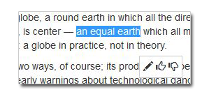
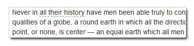

# Anternet Documentation
Anternet is a project that let you comment on any place on the web, at any time.

Think about it as a giant social media that's embedded anywere on the web. Anternet controlled by the users, works peer-to-peer, decentrialize and open-source for everyone.

Mark text and add comment:

See other comments on the paragraph:
    

**Current status:** Right now we are working on this documentaion specification and creating a team.

**Join us:** 

**Contact me:** [E-Mail](mailto:ms@development.co.il)

## Features
* Select a few words of text on any website and add a comment.
* User can choose which users to follow and see their own comments.
* Registration is simple and anonymously: just pick a nickname (no need for uniqueness).
* User can see which users comments on a website and follow them.
* All comments transmitting via peer-to-peer protocol (WebRTC).
* Installation made by browser extension (Firefox & Chrome).
* User can choose to turn off Anternet for some websites or specific pages.
* Websites can add Anternet for visitors without the extension via Javascript library.

## Modules

### Javascript Library
  1. Turn Anternet “on” for each web page is attached (i.e. by putting script near </body>).
  2. Connect to other peers and download relevant comments.
  3. Use signaling server to find peers and followable users.

### Browser Extension
  5. Attach Antentent library for each web page (except disabled websites & pages).
  6. Use browser storage to store identities and comments.
  7. Connect permanently to signaling server and serve comments.
  8. Store each downloaded comment and allow other peers to download it for 30 days.
  9. Write new comments and announcing them via signaling server.

### Signaling Server
#### `findUsers(url)`
Allows peers to find relevant users.
#### `getPeers(url, userId)`
Allow peers to find peers.
#### `announce(url, userId)`
Announce this peer s having comments for given `userId` and `url`.

## License

[**GPL 2.0**](LICENSE) © Copyright [Moshe Simantov](https://github.com/moshest)
